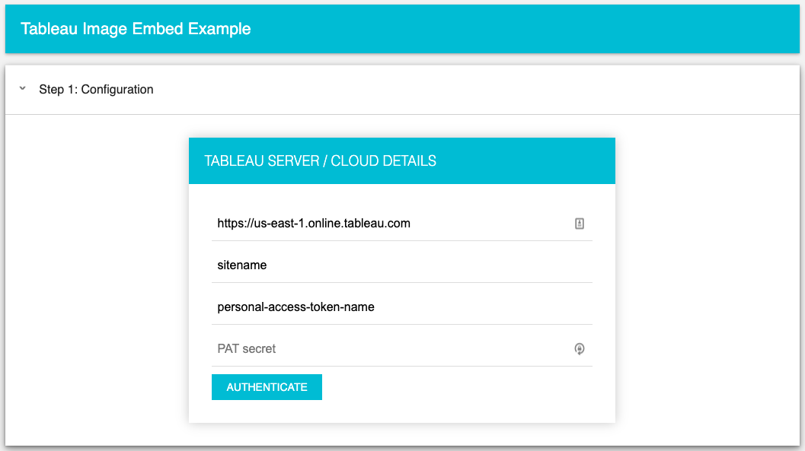
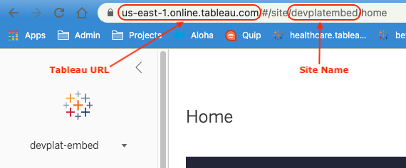
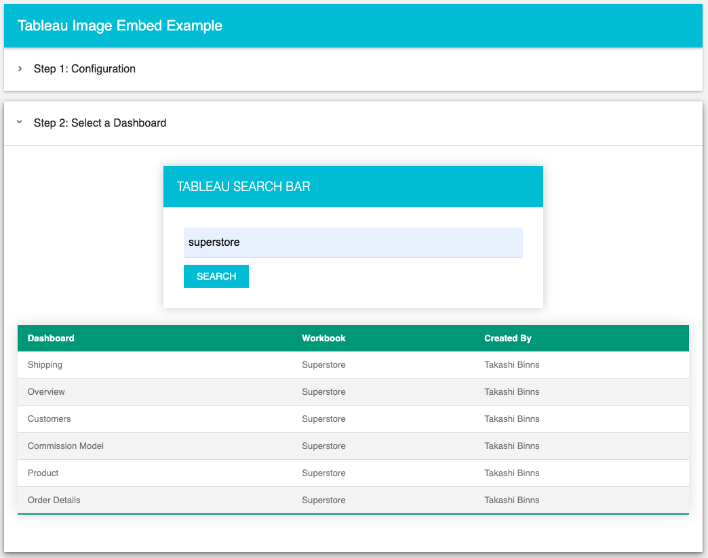
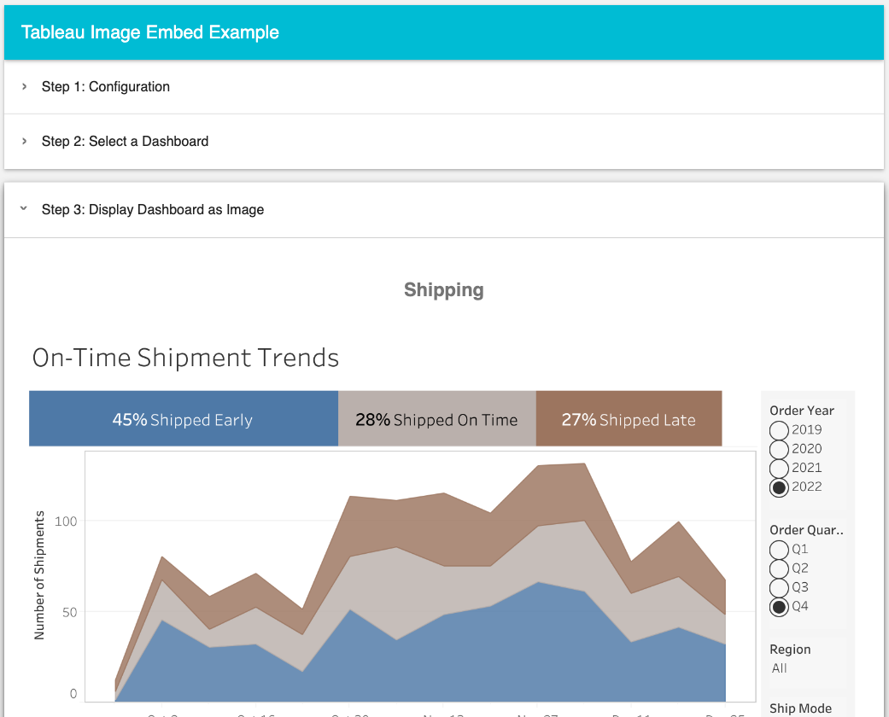

# Embedding Tableau dashboards as Images
Sample web app that shows how to embed tableau dashboards as static images.  Fully interactive dashboards can be embedded using Tableau's [Embedding API](https://help.tableau.com/current/api/embedding_api/en-us/index.html), but that requires the use of iframes.  If you are blocked from embedding using iframes, then you can reference this project to learn how to embed using static images via the REST API instead.  Static images aren't as good as the fully embedded experience, but you can click on the image to just open the dashboard in a new tab.

[Live Demo](https://tableau-embed-image-example.herokuapp.com/)

# How to use this app

### Step 1: Configuration


When you open this web app in a browser, you will be prompted for some tableau details. Enter the URL of your Tableau Server or Tableau cloud pod, along with the name of your site (leave blank for the default site on Tableau Server).  



You will also need a personal access token, details for getting this are available in our [documentation](https://help.tableau.com/current/server/en-us/security_personal_access_tokens.htm).  When ready, click the *AUTHENTICATE* button.  This will use the [SignIn](https://help.tableau.com/current/api/rest_api/en-us/REST/rest_api_ref_authentication.htm#sign_in) endpoint to authenticate your user and return an API token.  This app stores you config details in LocalStorage, so you don't have to enter your details every time you refresh the page.

### Step 2: Select a Dashboard


You should see a search bar, so just type in some search terms and click the *SEARCH* button.  This uses Tableau's [Content Exploration](https://help.tableau.com/current/api/rest_api/en-us/REST/TAG/index.html#operation/getSearch) endpoint to mimic the searchbar on Tableau Server/Cloud. This web app automatically adds a filter for `ContentType=View` and further filters the resultset for `sheetType=Dashboard`.  Each result will be displayed in the table below, just click on a row to view the dashboard.

### Step 3: Embed the dashboard as an Image


After clicking on a dashboard name from Step 2, we use the [Query View Image](https://help.tableau.com/current/api/rest_api/en-us/REST/rest_api_ref_workbooks_and_views.htm#query_view_image) endpoint to fetch the image.  The image gets generated on the Tableau side, and sent back as base64 string data.  We can just put the image data into an `` tag's `src` property, to render the image on the page.  We also setup a click handler, so if you click on the dashboard image, it takes you to the fully interactive dashboard hosted on Tableau.

# Setup
Since we are prompting the end user for tableau server credentials, there's really no configuration to do before running the app.  Clone this repo to your directory and run the following NPM commands to get up and running:
```
npm install
npm run start
```
